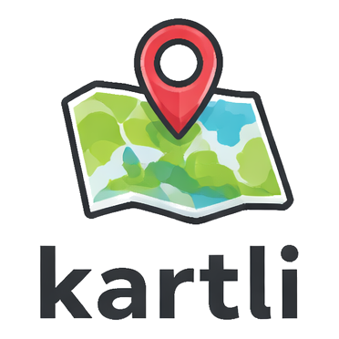

<p align="center">
  
</p>

<h1 align="center">kartli</h1>

<p align="center">
  Generate static map images from Python or the command line.<br>
  Swisstopo, OpenStreetMap, and ESRI satellite tiles. Markers, polygons, lines, scale bars.
</p>

## Install

```bash
pip install kartli
```

Requires Python 3.12+.

## Python SDK

All methods return `self`, so you can chain everything:

```python
from kartli import Map

(
    Map(width=800, height=600)
    .marker(46.9480, 7.4474, label="Start", color="blue")
    .marker(46.9510, 7.4380, label="End", color="red")
    .area(
        [(46.948, 7.443), (46.950, 7.443), (46.950, 7.450), (46.948, 7.450)],
        label="Area of interest",
        color="orange",
        opacity=0.3,
    )
    .line(
        [(46.9480, 7.4474), (46.9510, 7.4380)],
        label="Route",
        color="green",
        label_position=0.5,
    )
    .set_scale(25_000)  # 1:25'000
    .render("map.png")
)
```

Or build step by step:

```python
from kartli import Map, Marker, Area

m = Map(width=800, height=600)
m.add_marker(Marker(coord=(46.948, 7.447), label="Bern"))
m.add_area(Area(coords=[...], label="Zone", color="red"))
m.set_zoom(15)
m.render("map.png")
```

### Tile sources

Auto-detects Swisstopo for Swiss coordinates, OSM otherwise. Override explicitly:

```python
from kartli import Map, SwisstopoTiles, OsmTiles, EsriSatelliteTiles

Map(tile_source=SwisstopoTiles())                                    # topo map
Map(tile_source=SwisstopoTiles(layer="ch.swisstopo.swissimage"))     # aerial
Map(tile_source=EsriSatelliteTiles())                                # satellite (global)
Map(tile_source=OsmTiles())                                          # OSM
```

### Zoom

Set zoom by level or map scale (mutually exclusive):

```python
m.set_zoom(15)
m.set_scale(25_000)  # 1:25'000
```

Or omit both — zoom is auto-computed to fit all markers/areas/lines.

### Output

PNG or PDF, detected from extension. `render()` also returns a PIL `Image`:

```python
m.render("map.png")
m.render("map.pdf")
img = m.render()  # no file, just the Image object
```

## CLI

```bash
# Polygon on Swisstopo (auto-detected)
kartli render \
  --area "46.947,7.443;46.949,7.441;46.951,7.444;46.952,7.448;46.950,7.451" \
  -o polygon.png

# Markers at 1:25'000 scale
kartli render \
  --center 46.948,7.448 \
  --scale 1:25000 \
  --marker 46.9480,7.4474,Start \
  --marker 46.9510,7.4380,End \
  -o markers.png

# Satellite tiles, no scale bar
kartli render \
  --center 46.948,7.448 \
  --zoom 15 \
  --tiles swisstopo-satellite \
  --no-scalebar \
  -o satellite.png

# PDF output
kartli render \
  --center 46.948,7.448 \
  --scale 1:50000 \
  -o map.pdf
```

### Tile sources

| `--tiles` value | Source |
|---|---|
| *(auto)* | Swisstopo for Swiss coords, OSM otherwise |
| `swisstopo` | Swiss topo map |
| `swisstopo-satellite` | Swiss aerial imagery |
| `osm` | OpenStreetMap |
| `esri-satellite` | ESRI World Imagery (global) |

### Options

| Flag | Description |
|---|---|
| `--center LAT,LON` | Map center (auto-computed from objects if omitted) |
| `--zoom N` | Zoom level (mutually exclusive with `--scale`) |
| `--scale 1:N` | Map scale, e.g. `1:25000` (mutually exclusive with `--zoom`) |
| `--marker LAT,LON[,LABEL]` | Add marker (repeatable) |
| `--area LAT,LON;LAT,LON;...` | Add polygon (repeatable) |
| `--line LAT,LON;LAT,LON;...` | Add line (repeatable) |
| `--size WxH` | Image size in pixels (default: `800x600`) |
| `--no-scalebar` | Hide the scale bar |
| `-o FILE` | Output file (`.png` or `.pdf`, default: `map.png`) |

## Tile caching

Tiles are cached to `~/.cache/kartli/`. Second render of the same area is instant.

## License

MIT
